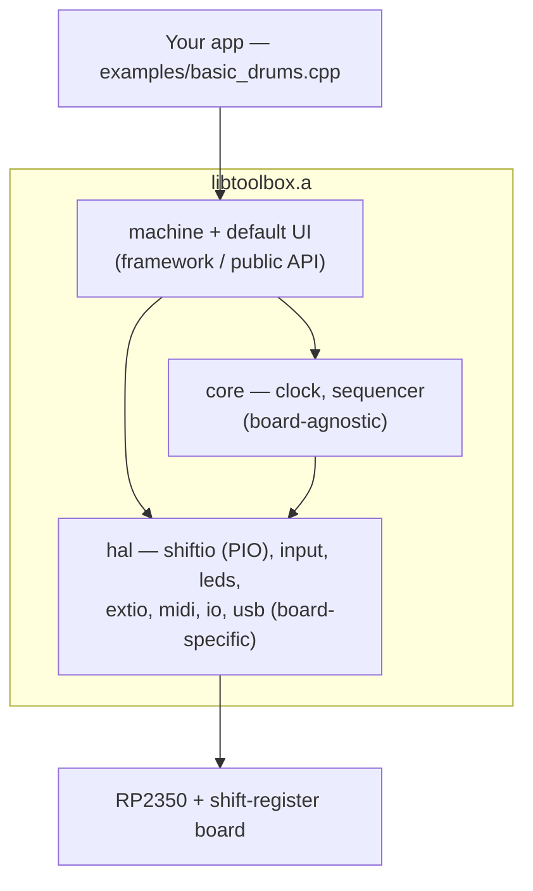
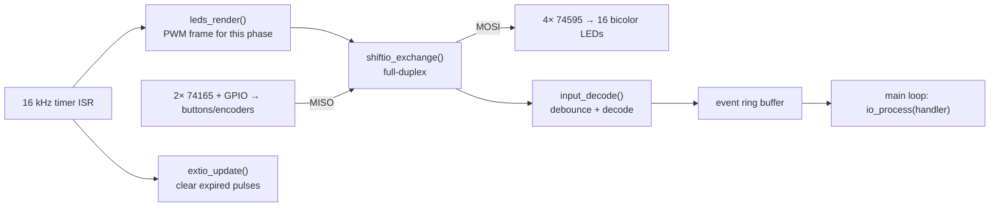
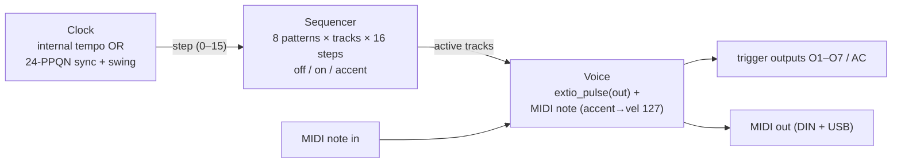

# Constructor's Guide

For the **builder/hacker**: how the Rhythm Toolbox is put together, how to build
and flash it, and how to write your own drum machine on top of it. If you just
want to *play* the default machine, see the [Musician's Guide](../musicians-guide/).

The companion hardware reference (every pin and IO detail) is
[`docs/io-map.md`](../io-map.md).

---

## 1. The idea

The toolbox hides the hard real-time work — shift-register scanning, gamma-PWM
LEDs, trigger timing, MIDI, the sequencer — behind a small library. **You write
your machine in one short file** (`examples/basic_drums.cpp`), declaring your
voices and tweaking behaviour through a simple API and optional hooks.

```cpp
#include "toolbox.h"
using namespace dmt;

static Track tracks[] = {
    {"BD", EXT_O1, 36}, {"SD", EXT_O2, 38}, {"CH", EXT_O3, 42},
};

int main() {
    Machine m;
    m.set_tracks(tracks, 3);
    m.set_tempo(120);
    m.run();          // never returns
}
```

---

## 2. Architecture

Three layers. The bottom (HAL) is the only board-specific part — port it and the
rest is unchanged.



| Layer | Files | Responsibility |
|-------|-------|----------------|
| **app** | `examples/*.cpp` | declares voices, patterns, hooks — *you edit this* |
| **machine** | `lib/machine.*`, `lib/toolbox.h` | framework + default front-panel UI |
| **core** | `lib/core/clock.*`, `sequencer.*` | timing + the X0X pattern model |
| **hal** | `lib/hal/*` | the shift-register bus, LEDs, triggers, inputs, MIDI, USB |

---

## 3. The IO engine

A single hardware timer at **16 kHz** owns the shared shift-register bus. Each
tick does **one full-duplex transaction**: it clocks the LED frame out to the
74595s *and* reads the buttons in from the 74165s at the same time, then decodes
inputs into events. The LED PWM and input debounce are both driven from this tick.



- **LED brightness** is perceptual (0–255), gamma-corrected, time-multiplexed for
  colour mixing (see `lib/hal/leds.*`).
- **Input events** are produced in the ISR and drained in the main loop — handlers
  never run in interrupt context.
- The external **sync clock** (24 PPQN) is counted by a separate GPIO interrupt
  (`io_sync_ticks()`), not the polled path, for tight timing.

---

## 4. The musical signal chain



---

## 5. Build & flash

Needs the [Raspberry Pi Pico SDK](https://github.com/raspberrypi/pico-sdk) (set
`PICO_SDK_PATH`) and an `arm-none-eabi` toolchain.

```sh
cmake -S . -B build -G Ninja -DCMAKE_BUILD_TYPE=Release
cmake --build build
picotool load -x build/basic_drums.uf2     # or drag the .uf2 onto BOOTSEL
```

- **USB MIDI** is on by default (composite USB MIDI + USB serial + picotool
  reset). Use `-DTOOLBOX_USB_MIDI=OFF` for a CDC-only device.
- Each file in `examples/` is its own flashable target.

---

## 6. The API

Everything is in the `dmt` namespace via `toolbox.h`.

### Declaring voices

```cpp
struct Track {
    const char *name;   // label
    ExtOut      out;    // trigger output: EXT_O1..EXT_O7, EXT_AC2, EXT_AC3
    uint8_t     note;   // MIDI note (0 = none)
};
```

### The machine

```cpp
m.set_tracks(tracks, count);          // up to 8 (selectable by the editable rotary)
m.set_tempo(bpm);
m.set_pulse_us(us);                   // trigger pulse length (default 5 ms)
m.set_led_levels(on, accent, playhead); // UI brightness, 0..255 each
m.set(track, step, STEP_ON/STEP_ACCENT); // preload pattern 0
m.on_step([](uint8_t step){ /* runs once per step */ });
m.run();
```

### Direct hardware (for custom apps / hooks)

```cpp
// LEDs (16× bicolor)
leds_set(led, LED_COLOR1/COLOR2/OFF, brightness);
leds_set_mix(led, c1, c2);            // colour mix (time-multiplexed)
leds_set_blend(led, blend, brightness);
leds_commit();

// Trigger outputs
extio_pulse(EXT_O1, len_us);          // fire a pulse
extio_set(EXT_O1, on);                // static level

// MIDI (UART + USB)
midi_send(0x90 | ch, note, vel);
MidiMsg msg; while (midi_read(&msg)) { ... }

// Sync
uint32_t ticks = io_sync_ticks();     // 24-PPQN external clock count
```

These low-level calls are also available from `on_step` hooks in your app, or in
a fully custom `main()` that drives `io_init()` / `io_process()` directly.

---

## 7. Customizing

- **Voices / outputs** — edit the `tracks[]` array.
- **LED colours & levels** — `set_led_levels()`, or change the scheme in
  `Machine::render_leds()` (on = colour1, accent = blend, playhead = colour2).
- **Board wiring** — button order and LED chain order are table-driven and
  isolated, so you adapt firmware to your board by editing tables, not logic:
  `kSwitch[]` / `kDirect[]` (`input.cpp`) for buttons, `led_bit()` (`leds.cpp`)
  for the LED chain, pin assignments in `pins.h`.
- **Different hardware** — re-implement `lib/hal/*` against your wiring; `lib/core`
  and `lib/machine` stay the same.

---

## 8. Notes on USB

The device enumerates as a **composite**: USB MIDI + a USB serial port (for
`printf` debugging) + the picotool reset interface (so it reflashes without
touching BOOTSEL). The reset interface needs the Microsoft OS 2.0 descriptor to
work driverless on Windows — that's provided by the SDK with the reset interface
placed at **interface index 2** (see `lib/hal/usb/usb_descriptors.c`).
