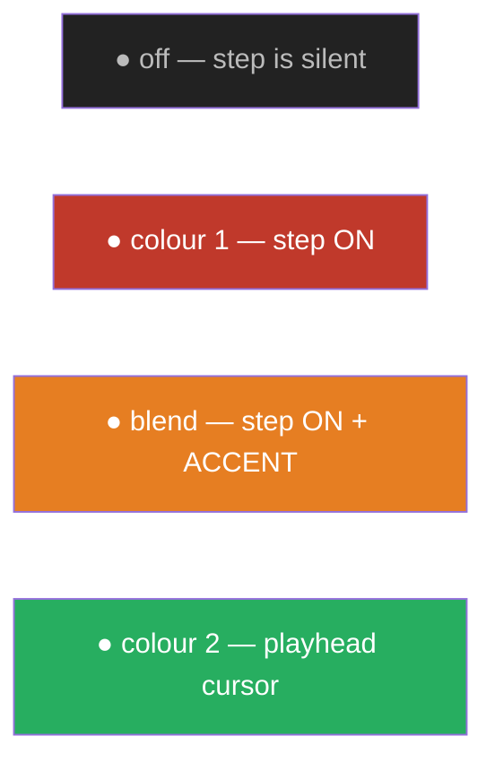
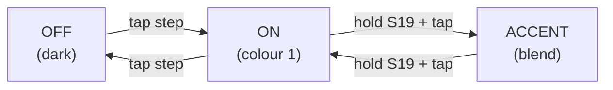

# Musician's Guide

For **playing** a Rhythm Toolbox drum machine running the default firmware. No
coding — just the panel.

> Control labels (S1–S20, rotaries, pots) match the silkscreen on the board.
> If your build's labels differ, check with whoever built it.

---

## The panel at a glance

| Control | What it does |
|---------|--------------|
| **S1–S16** | the 16 step buttons (one bar of 16th notes) |
| **S17** | start / stop |
| **S18** | fill (hold) |
| **S19** | accent (hold, then tap steps) |
| **S20** | clear the current track |
| **Rotary 1** (mode) | pattern select (positions 0–6); position 7 = config |
| **Rotary 2** (editable) | which track/voice you're editing |
| **Pot A1** | tempo |
| **Pot A0** | shuffle / swing |
| **Switch 1** | external sync on/off |
| **Sync / Start in** | external clock + transport (jacks) |
| **16 LEDs** | the step grid for the current track |

### LED colours

(Default mapping: **on = colour 1**, **accent = a blended colour**, **playhead =
colour 2**. The playhead is the bright dot sweeping left→right as it plays.)

---

## Play / stop

- Press **S17** to start and stop.
- Or feed an external **start** signal / turn **Switch 1** on to follow an external
  **sync** clock (24 PPQN) coming into the sync jack — the machine locks to it.

---

## Programming a beat

Pick the voice to edit with **Rotary 2** (e.g. bass drum, snare, hat). The 16 LEDs
show that voice's pattern. Then tap the step buttons:

- **Tap a step** → toggles it on/off.
- **Hold S19 (accent)** and tap a step → toggles its accent. Accented hits play
  louder (MIDI velocity 127) and fire the accent output.
- **S20** clears the current track.

Switch voices with **Rotary 2** and build up the kit one track at a time.

---

## Patterns, fills, tempo

- **Rotary 1** selects the pattern (positions 0–6) — switch between parts live.
- **S18 (fill)** — hold it to play the **fill pattern** while held; release to drop
  back. (You can program the fill pattern by holding S18 while editing.)
- **Pot A1** sets the **tempo** (≈ 40–240 BPM).
- **Pot A0** sets the **shuffle / swing** — straight at one end, heavy shuffle at
  the other.

---

## Config

Turn **Rotary 1** to its **last position** to enter config. Then:

- **Hold a left button (S1–S8)** = pick the setting,
- **tap a right button (S9–S16)** = choose its value.

The left LEDs show the available settings; the right LEDs show the current value of
the held setting. (Setting 1 = trigger pulse length.)

Turn Rotary 1 back to a pattern position to return to normal play — your pattern
keeps running throughout.

---

## MIDI

The machine speaks MIDI over both the **DIN socket** and the **USB cable** at once:

- **Out** — every hit sends a MIDI note (accents at velocity 127), so you can drive
  a synth or record into a DAW.
- **In** — incoming MIDI notes trigger the matching voices, so you can play the kit
  from a keyboard or sequence it from your DAW.

Over USB the machine appears as **"Drum Machine MIDI"** — no driver needed.
