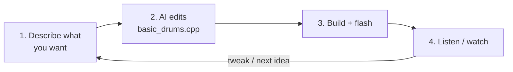

# Vibe Coder's Guide

For making the drum machine *yours* by **editing one file with an AI assistant** —
Claude, or whichever coding model you like. You describe what you want in plain
language; the AI edits the example; you build, flash, and listen. No need to be a
firmware engineer.

If you'd rather hand-write code, the [Constructor's Guide](../constructors-guide/)
has the full API. If you just want to *play*, see the
[Musician's Guide](../musicians-guide/).

---

## The idea

Almost everything you'd want to change lives in **one short file**:
[`examples/basic_drums.cpp`](../../examples/basic_drums.cpp). The rest of the
toolbox is a stable library you don't touch. So the loop is simple:



---

## Setup

1. Get an AI coding assistant that can read and edit files in this repo — e.g.
   **Claude Code** in your terminal, or an editor with an AI agent.
2. Point it at the repo and tell it the ground rules (copy this in):

   > This is the Rhythm Toolbox. I want to customize my drum machine by editing
   > **only `examples/basic_drums.cpp`**, using the public API in `lib/toolbox.h`
   > / `lib/machine.h` and the docs in `docs/constructors-guide/`. Don't change
   > the library under `lib/` unless I ask. After each change, build with
   > `cmake --build build`.

3. That's it — now just ask for changes.

---

## What you can change (and what to ask for)

| You want… | Say something like… |
|-----------|---------------------|
| **More/fewer voices** | "Add a 7th voice called RIM on output `EXT_O7`, MIDI note 37." |
| **Different outputs/notes** | "Change the snare to output O4 and MIDI note 40." |
| **A starter beat** | "Preload a four-on-the-floor house beat with offbeat open hats." |
| **Tempo** | "Start at 128 BPM." |
| **LED look** | "Make the playhead dimmer and the accents brighter." |
| **Trigger length** | "Make the trigger pulses 2 ms." |
| **Custom behaviour each step** | "Every 4th step, also fire output O7." |
| **MIDI mapping** | "Send the kick on MIDI channel 10, note 36." |

The AI turns these into calls like `m.set_tracks(...)`, `m.set_tempo(...)`,
`m.set(track, step, STEP_ON)`, `m.set_led_levels(...)`, and `m.on_step(...)`. You
don't need to know the calls — but you can peek at the example to learn them.

---

## The build / listen loop

After the AI makes a change:

```sh
cmake --build build
picotool load -x build/basic_drums.uf2     # or drag the .uf2 onto BOOTSEL
```

Then **listen and watch**, and tell the AI what happened — exactly like talking to
a bandmate:

- "The hats are too loud" → it adjusts velocity/accents.
- "The playhead is green but I want it dimmer" → it changes `set_led_levels`.
- "It's not triggering my synth" → it checks the MIDI note/channel.

Iterating from what you *observe on the hardware* is the whole game. Describe the
result, not the code.

---

## Tips for good results

- **One change at a time.** Small steps are easier to hear and to undo.
- **Describe musically.** "Add a clap on the backbeat" beats "set array index 4."
- **Ask it to explain.** "What does `on_step` do?" — the AI can teach you the API
  as you go.
- **Keep it in the example.** If the AI wants to edit files under `lib/`, ask why;
  most customization shouldn't need it.
- **Use version control.** Commit when something sounds good, so you can always get
  back to it. (The AI can do this too — just ask.)
- **Verify on hardware.** The simulator is your ears; flash and listen.

---

## When you need more

Some changes go beyond the example — new front-panel behaviour, a different
sequencer, supporting different hardware. Those live in `lib/` and are covered by
the [Constructor's Guide](../constructors-guide/). You can still do them with an AI
assistant; just point it there and expect a bit more back-and-forth (and test
carefully).
